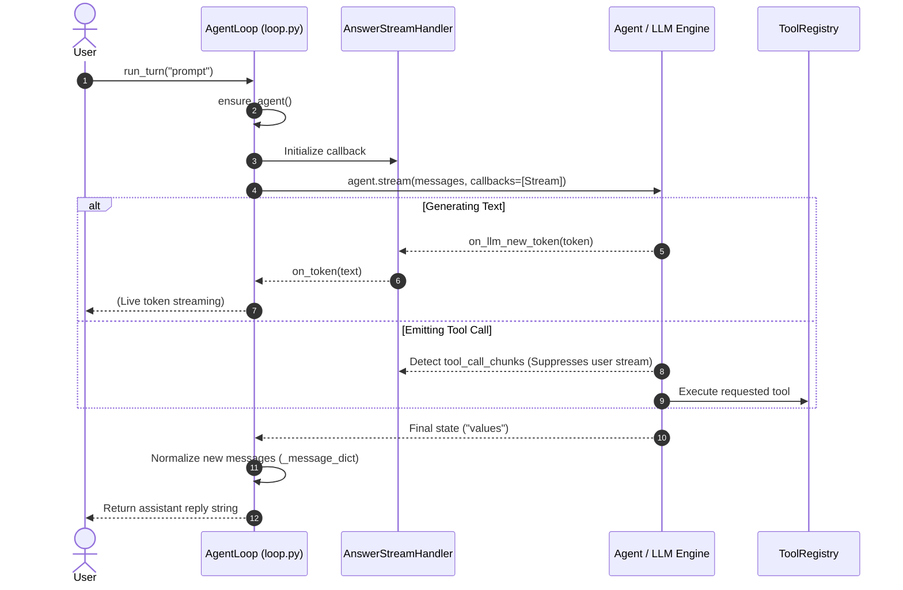

# Agent

```mermaid
sequenceDiagram
    autonumber
    actor User
    participant AgentLoop as AgentLoop (loop.py)
    participant Stream as AnswerStreamHandler
    participant LLM as Agent / LLM Engine
    participant Tools as ToolRegistry

    User->>AgentLoop: run_turn("prompt")
    AgentLoop->>AgentLoop: ensure_agent()
    AgentLoop->>Stream: Initialize callback
    AgentLoop->>LLM: agent.stream(messages, callbacks=[Stream])
    alt Generating Text
        LLM-->>Stream: on_llm_new_token(token)
        Stream-->>AgentLoop: on_token(text)
        AgentLoop-->>User: (Live token streaming)
    else Emitting Tool Call
        LLM-->>Stream: Detect tool_call_chunks (Suppresses user stream)
        LLM->>Tools: Execute requested tool
    end
    LLM-->>AgentLoop: Final state ("values")
    AgentLoop->>AgentLoop: Normalize new messages (_message_dict)
    AgentLoop-->>User: Return assistant reply string
```

## Loop

./loop.py

## Prompt

./prompts.py

## StreamHandler

./utils/stream_handler.py